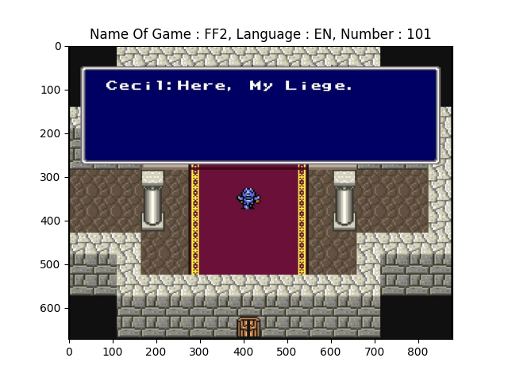
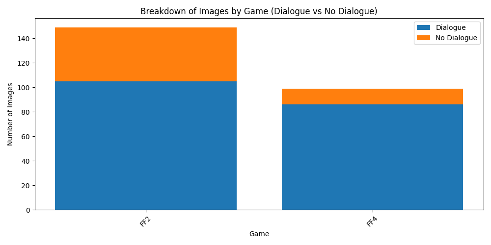
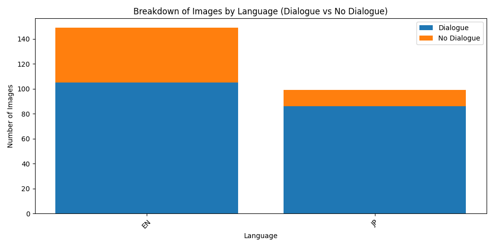
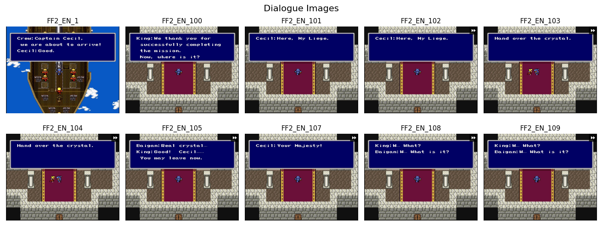
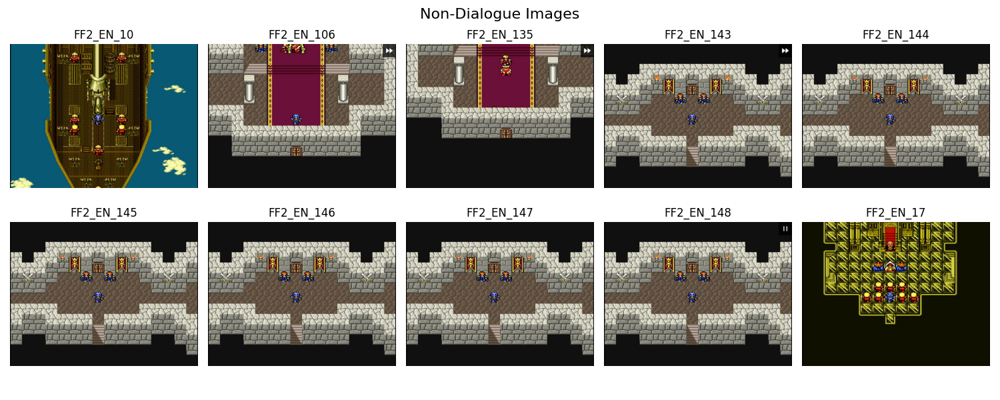
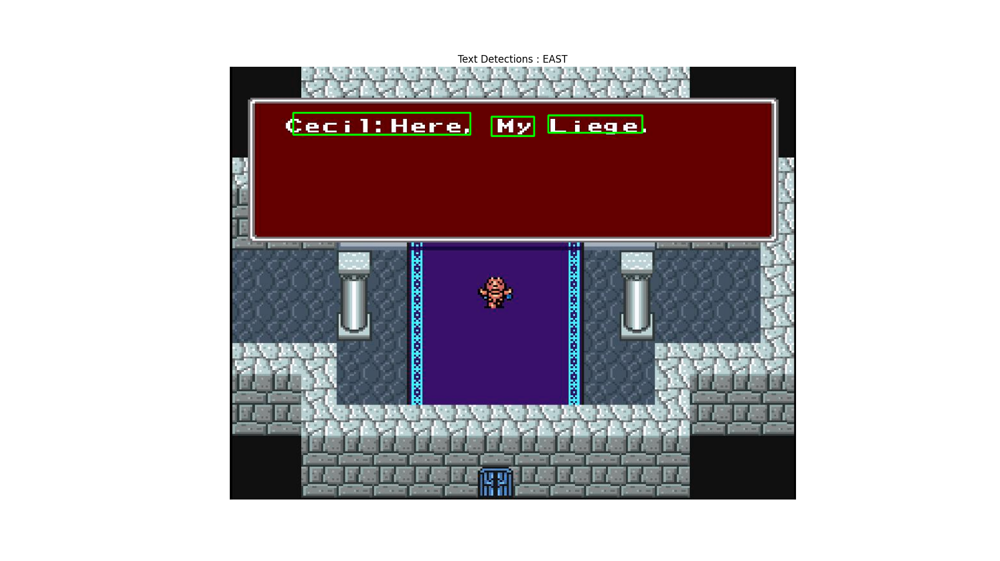
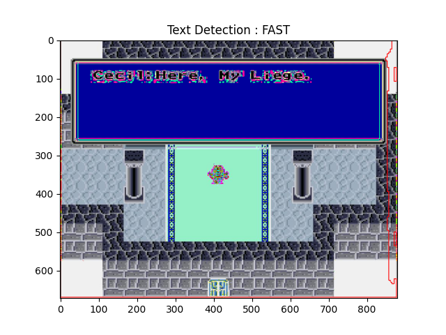

# Evaluation 

## 1. Data Collection

- The screenshots from the games are grabbed and save in a folder. 
- Screenshots are renamed in the format of `{Name of Game}_{lang}_{id}.jpg`. eg. FF4_EN_3.jpg.
- Evaluation images are stored in the folder `retro_voice/eval_data`
- The dataset can be constructed using `Dataset` class from `evaluation/dataset.py`.
- Simple stats can be extracted from `Dataset`.
    - dataset size
    - number breakdown by game and language.
    - number breakdown by dialogue and no dialogue.
    - visualization of stats for dataset.

```shell
# go back to retro_voice directory
cd ../

python evaluation/download_dataset.py

```

```shell
python evaluation/dataset.py

output:
    Dataset size: 248
    Game breakdown: {'FF2': 149, 'FF4': 99}
    Language breakdown: {'EN': 149, 'JP': 99}
    Time taken to calculate dialogue stats: 9.03 seconds
    Game Dialogue breakdown: {'FF2': 105, 'FF4': 86}
    Game No Dialogue breakdown: {'FF2': 44, 'FF4': 13}
    Language Dialogue breakdown: {'EN': 105, 'JP': 86}
    Language No Dialogue breakdown: {'EN': 44, 'JP': 13}
```





-

## 2. Ground Truth Labelling Framework

Pretrained Models are used to generate annotations.
### Inference Scripts

#### Detection 

##### EAST

```shell
python evaluation/detection_inference.py -m east -v
```
This scripts run EAST detection model on the dataset and saves the output in the eval_data/detection_east.json file.
```json
[   {
        "filename": "FF2_EN_10.jpg",
        "time_taken": 0.038869619369506836,
        "predictions": [
            [
                329,
                39,
                392,
                71
            ]
        ]
    },
    ...
    ]
```
if visualize:


##### FAST

```shell
python evaluation/detection_inference.py -m fast -v
```
This scripts run FAST detection model on the dataset and saves the output in the eval_data/detection_fast.json file.
```json
[
    {
        "filename": "FF4_JP_97.jpg",
        "time_taken": 0.020201683044433594,
        "predictions": [
            [
                0,
                0,
                0,
                670,
                877,
                670,
                877,
                0
            ]
        ]
    },
    ...
]
```
if visualize,


Note: need to experiment with different fast models. 

#### CRAFT