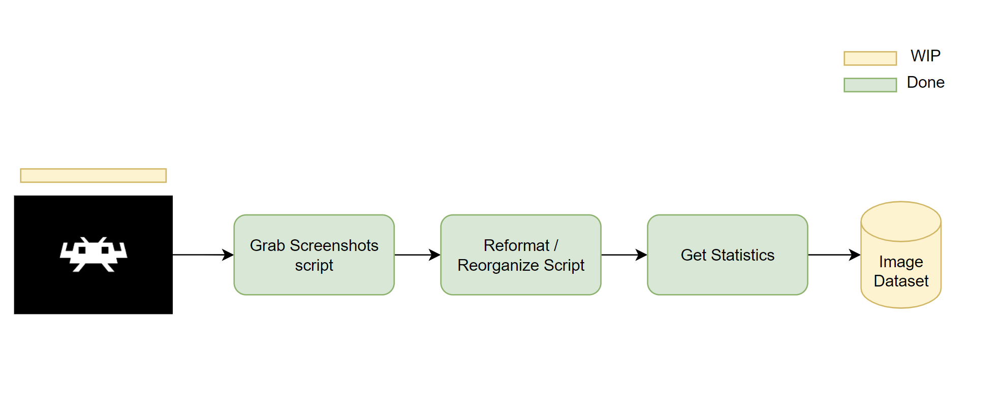
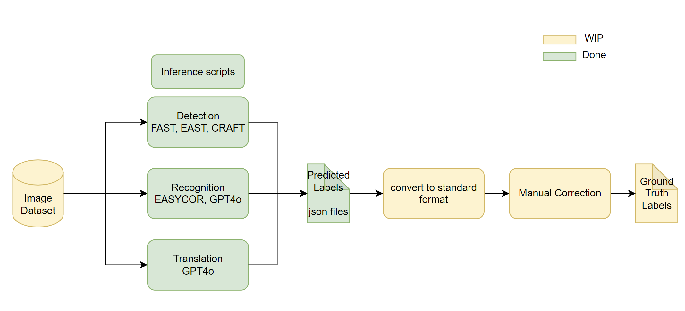
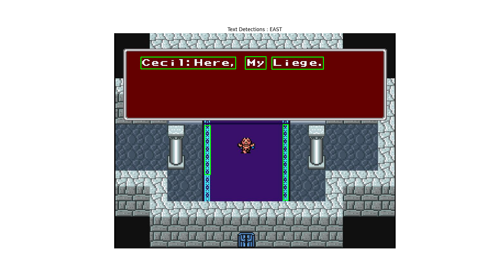
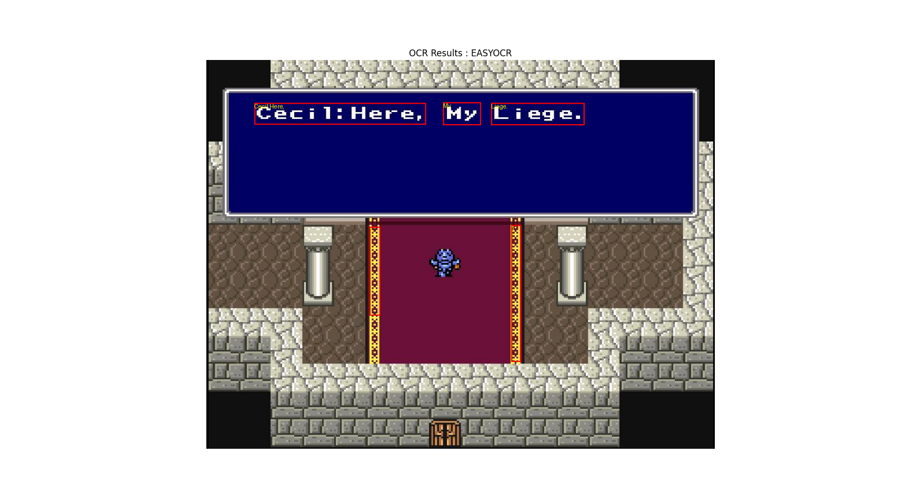
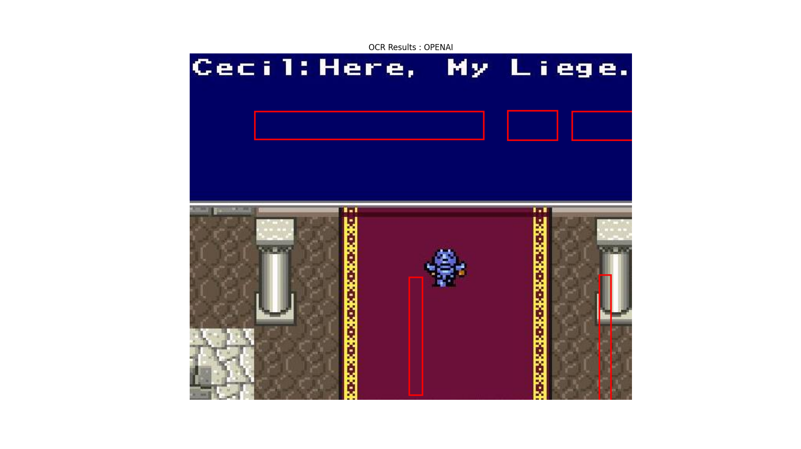
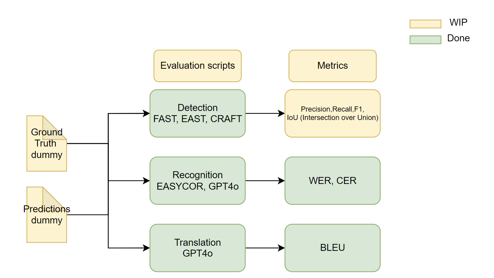

# Evaluation 

## 1. Data Collection

### Status


- The screenshots from the games are grabbed and save in a folder. 
- Screenshots are renamed in the format of `{Name of Game}_{lang}_{id}.jpg`. eg. FF4_EN_3.jpg.
- Evaluation images are stored in the folder `retro_voice/eval_data`
- The dataset can be constructed using `Dataset` class from `evaluation/dataset.py`.
- Simple stats can be extracted from `Dataset`.
    - dataset size
    - number breakdown by game and language.
    - number breakdown by dialogue and no dialogue.
    - visualization of stats for dataset.

```shell
# go back to retro_voice directory
cd ../

python evaluation/download_dataset.py

```

```shell
python evaluation/dataset.py

output:
    Dataset size: 248
    Game breakdown: {'FF2': 149, 'FF4': 99}
    Language breakdown: {'EN': 149, 'JP': 99}
    Time taken to calculate dialogue stats: 9.03 seconds
    Game Dialogue breakdown: {'FF2': 105, 'FF4': 86}
    Game No Dialogue breakdown: {'FF2': 44, 'FF4': 13}
    Language Dialogue breakdown: {'EN': 105, 'JP': 86}
    Language No Dialogue breakdown: {'EN': 44, 'JP': 13}
```


-

## 2. Ground Truth Labelling Framework

Pretrained Models are used to generate annotations.

### Status


### Inference Scripts

#### Detection 

##### EAST

```shell
python evaluation/detection_inference.py -m east -v
```
This scripts run EAST detection model on the dataset and saves the output in the eval_data/detection_east.json file.
```json
[   {
        "filename": "FF2_EN_10.jpg",
        "time_taken": 0.038869619369506836,
        "predictions": [
            [
                329,
                39,
                392,
                71
            ]
        ]
    },
    ...
    ]
```
if visualize:


##### FAST

```shell
python evaluation/detection_inference.py -m fast -v
```
This scripts run FAST detection model on the dataset and saves the output in the eval_data/detection_fast.json file.
```json
[
    {
        "filename": "FF4_JP_97.jpg",
        "time_taken": 0.020201683044433594,
        "predictions": [
            [
                0,
                0,
                0,
                670,
                877,
                670,
                877,
                0
            ]
        ]
    },
    ...
]
```
if visualize,


Note: need to experiment with different fast models. 

##### CRAFT

```shell
python evaluation/detection_inference.py -m craft -v
```

```json
[
    {
        "filename": "FF2_EN_136.jpg",
        "time_taken": 0.05401873588562012,
        "predictions": [
            [
                [
                    83,
                    407,
                    74,
                    114
                ],
                [
                    438,
                    568,
                    76,
                    108
                ]
            ]
        ]
    },
    ...
]
```


#### Recognition

##### EASYOCR
```shell
python evaluation/recognition_inference.py  -m easyocr -v 
```
This scripts run EASYOCR recognition model on the dataset and saves the output in the eval_data/recognition_easyocr.json file.

```json
[
    {
        "filename": "FF2_EN_23.jpg",
        "time_taken": 0.13318705558776855,
        "text": "White Hizord: No! Don\" +! Crew: Dore t0 defy Us?"
    },
    ...
]
```


##### GPT4o
```shell
python evaluation/recognition_inference.py  -m openai -v 
```
This scripts run OPENAI GPT4o recognition model on the dataset and saves the output in the eval_data/recognition_openai.json file.

```json
[
    {
        "filename": "FF2_EN_23.jpg",
        "time_taken": 8.582889080047607,
        "text": " White Wizard:No!  Don't! Crew:Dare to defy us? "
    },,
    ...
]
```

The annotated image is wrong here. needs to fix that. 

#### Translation

```shell
python evaluation/translation_inference.py -h
usage: translation_inference.py [-h] -m {easyocr,openai} -o OUTPUT_JSON -l LOG_FILE [-r REUSE_OCR_JSON]

Run OCR and translation on a dataset.

options:
  -h, --help            show this help message and exit
  -m {easyocr,openai}, --ocr_method {easyocr,openai}
                        The OCR method to use (easyocr or openai).
  -o OUTPUT_JSON, --output_json OUTPUT_JSON
                        The output JSON file to save the translation results.
  -l LOG_FILE, --log_file LOG_FILE
                        The log file to save the processing details.
  -r REUSE_OCR_JSON, --reuse_ocr_json REUSE_OCR_JSON
                        Reuse a previous OCR JSON file instead of running OCR again.
```

```shell
python evaluation/translation_inference.py -m openai -o eval_data/translation_openai.json  -l eval_data/translation_openai_log.txt -r eval_data/recognition_openai.json 
```


```json
[
    {
        "filename": "FF2_EN_88.jpg", 
        "original_text": " Baigan:Please wait here. ", 
        "translated_text": " バイガン：ここでお待ちく ださい。 "
    }, 
    {
        "filename": "FF2_EN_91.jpg", 
        "original_text": " Baigan: Your Majesty! I\"m afraid Cecil has developed quite a rebellious air. ", 
        "translated_text": "  バイガン: 陛下! セシルがかなり反抗的な態度を取るようになったのではないかと心配です。  "
    }, 
    {
        "filename": "FF2_EN_92.jpg", 
        "original_text": " dy!? re, Baigan! do something. in! ", 
        "translated_text": " えっ！？ これ、バイガン！何かしなさい。中に！ "
    }
]
```


## 3. Evaluation

### Status


### Detection


### Recognition
```shell
python evaluation/evaluate_recognition.py
```
```shell
output:
Average Character Error Rate (CER): 3.49%
Average Word Error Rate (WER): 6.28%

Wrong Characters:
Filename: FF2_EN_1.jpg, Predicted: , Ground Truth: iv
Filename: FF2_EN_100.jpg, Predicted: , Ground Truth: successfully
Filename: FF2_EN_101.jpg, Predicted: da, Ground Truth:

Wrong Words:
Filename: FF2_EN_1.jpg, Predicted: arre!, Ground Truth: arrive!
Filename: FF2_EN_100.jpg, Predicted: , Ground Truth: successfully
Filename: FF2_EN_101.jpg, Predicted: da, Ground Truth:
```
This script returns CER and WER as well as prints out the incorrect filenames and errors.

### Translation
```shell
python evaluation/evaluate_translation.py
```
```shell
output:
Average BLEU Score: 89.23%

Wrong Translations:
Filename: FF2_EN_109.jpg
Original Text:  King: W... What? Baigan: W... What is it?
Translated Text: キング: なんだって…？ バイガン: なんだって…？
Ground Truth: キング: わ...何?バイガン: わ…何ですか？
BLEU Score: 0.71
```
This script returns BLEU as well as prints out mismatched filenames and translations.
